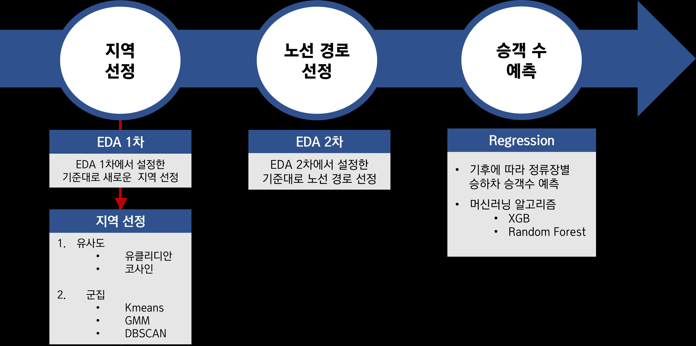

# Multicampus Final project 3조

## 다람쥐 버스의 부활
> 운행중인 다람쥐 버스의 특성을 분석하여, 다람쥐 버스가 필요한 새로운 지역을 선정하고 경로를 설정하는 프로젝트 입니다.  

다람쥐 버스란?  
- 출퇴근시간에 특정구간 반복 운행하는 버스
- 버스의 승객 수송량을 보조해주고 교통체증을 완화해주기 위한 서비스      


## 목차
- 프로젝트 구성원
- 개요 
- 프로젝트 흐름도
- 프로젝트 진행 과정
- 데이터 출처 
- Git Hub Commit


## 개요
- 프로젝트 이름 : 수요 대응 버스 분석 및 노선 신설 방안 제시
- 프로젝트 구성원 : 양충모, 김은비, 김지연, 서정식   
- 프로젝트 배경 : 하기 이유들로 기존 지역 이외에도 다람쥐 버스의 새로운 노선 신설 필요       
  - 출근 시간대 대중교통 혼잡도 감소 필요
  - 기존 다람쥐 버스 도입 후 높은 수요 & 도입 효과
  - 다람쥐 버스 노선의 신설에 대한 긍정적인 여론
  - 

- 분석 과정  
  - 기존 다람쥐 버스 분석
  - 다람쥐 버스가 필요한 새로운 지역 탐색
  - 새로운 지역내에 다람쥐 버스 경로 설정
  - 다람쥐버스의 배차수와 배차간격 설정  

## 프로젝트 흐름도      
   
 
## 프로젝트 진행과정
- 데이터 수집  
  다람쥐 버스 정류장의 시간별 승하차 승객수를 수집한다.       
- 기존 다람쥐 버스 분석     
  기존 다람쥐 버스 정류장의 인프라 특징이 어떤지 분석한다.      
- 다람쥐 버스 신설 지역 선정 
  분석한 내용을 토대로 다람쥐 버스가 필요한 지역을 선정한다.   
- 다람쥐 버스 노선 경로 설정    
  분석한 내용을 토대로 다람쥐 버스의 경로를 설정한다.
- 다람쥐 버스 배차 수와 배차 간격 설정      
  다람쥐 버스가 효율적으로 운행할 수 있도록 배차 수와 배차 간격을 설정한다.  

## 데이터 출처 
- 공공데이터 
- 통계청 
- KAKAO API 

## Git Hub Commit 
```
- feat: 새로운 기능에 대한 커밋
- fix: 수정에 대한 커밋
- chore: 그 외 자잘한 수정에 대한 커밋(기타 변경)
- docs: 문서 수정에 대한 커밋
- style: 코드 스타일 혹은 포맷 등에 관한 커밋
- refactor: 코드 리팩토링에 대한 커밋
```
